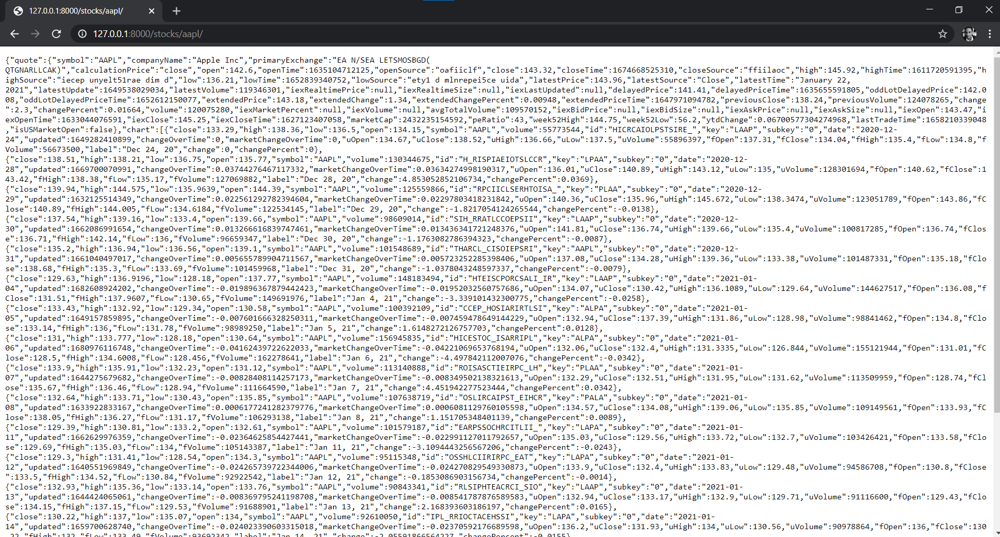

# Obsido - CUNY HACKATHON PROJECT

## Inspiration
Covid-19 being a massive thing in today’s world, we wanted to see how we could create something to tackle one of many issues caused by the pandemic.

## What it does
We developed a tool to mitigate the financial disruptions caused by Covid-19 by assessing user's financial standing and to determine their potential to venture off into expenditures and investments.

## How we built it
We built it by putting together different technologies like Bubble.io, IEX cloud, and Google cloud to name a few in order to asses user inputs and requested API inputs.

## Challenges we ran into
Some of the challenges we ran in to was getting the different technologies to communicate with one another.

## Accomplishments that we're proud of
We are proud of being able to get a team together and use agile programming to develop the Obsido application while using new technologies like Bubble.io.

## What we learned
We learned how to build the restAPI in order to serve data to the website, while also learning to implement the IEX API, and above all how to continue to developing teamwork skills to work more effectively as a team.

## What's next for Obsido
To optimize the code and algorithms, expand on the current APIs' capabilities, while also expanding on other financial assessment features to further increase the precision of analyzing the user's financial standing.

## Usage
To test the api, make a curl request at 
[https://dosido-api.ue.r.appspot.com/](https://dosido-api.ue.r.appspot.com/)

### Response example: 

